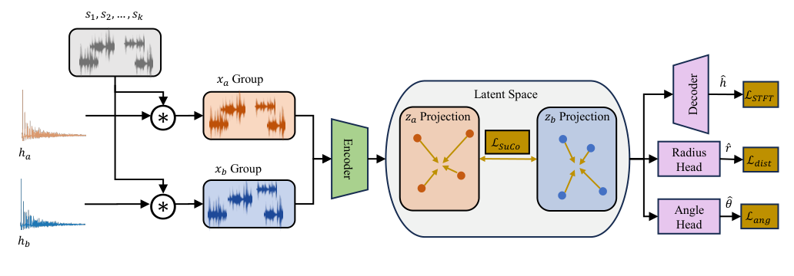

# CoMAL

Publication CoMAL, single-microphone acoustic localization.

## Model Architecture



## Installation

```bash
pip install -e .
```

Or:

```bash
pip install -r requirements.txt
```

The default dataset, checkpoint, and log paths are `data/rir_dataset`, `data/librispeech`, `checkpoints`, and `logs`. Override them with environment variables (pydantic-settings), for example:

```bash
export rir_dataset_path=/path/to/rir_dataset
export librispeech_path=/path/to/librispeech
export checkpoint_dir=/path/to/checkpoints
export logging_dir=/path/to/logs
```

## Dataset generation

Generate the image-source RIR dataset (requires LibriSpeech):

```bash
python -m acoustic_localization_one_mic.rir_dataset.genereate_dataset
```

## Training

Entry point: `acoustic_localization_one_mic.fins.rir_pipeline.main_pipline`.

```bash
python -m acoustic_localization_one_mic.fins.rir_pipeline
```
## Evaluation

Compare With-SuCo and No-SuCo checkpoints across SNR. Edit paths in the example script if needed:

```bash
python scripts/evaluation_scripts/example_snr_evaluation.py
python scripts/evaluation_scripts/example_snr_evaluation.py --dataset_path /path/to/rir_dataset
```

Or call the evaluator directly:

```bash
python scripts/evaluation_scripts/evaluate_test_dataset.py /path/to/checkpoint.ckpt --dataset_split valid --batch_size 64

python scripts/evaluation_scripts/plot_angular_error_vs_snr.py checkpoints/With-SuCo.ckpt \
    --checkpoint_path_b checkpoints/No-SuCo.ckpt \
    --label_a With-SuCo --label_b No-SuCo \
    --dataset_split test --batch_size 100
```

The SNR script writes JSON for overall error, per-room geometry, and pooled RT60 bins, plus paper-style figures.

## License

See [LICENSE](LICENSE) file for details.
